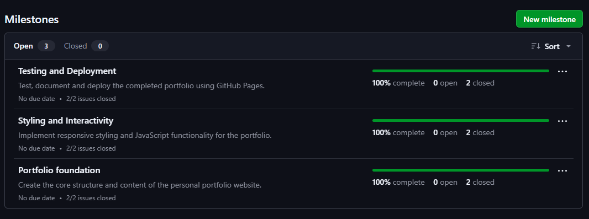
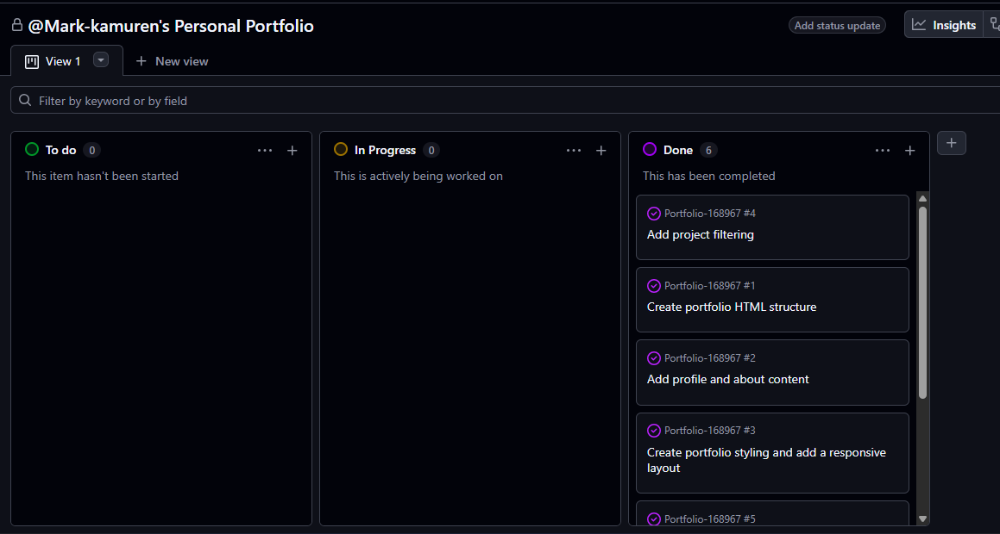
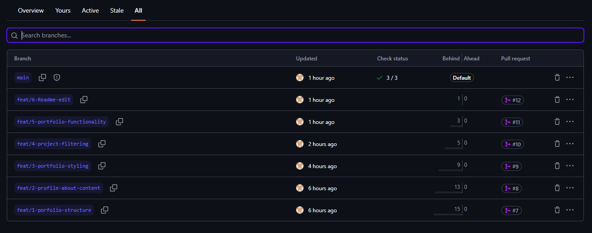
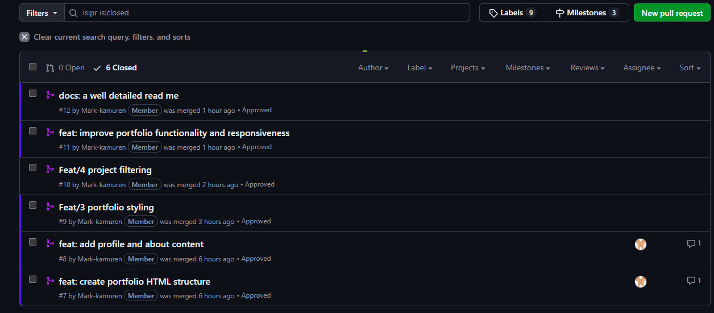
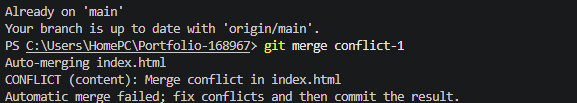
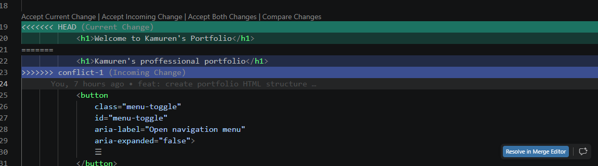

# Project Submission Report

## 1. Student Details

- **Full Name:** Kangogo Mark Kamuren
- **GitHub Username:** Mark-kamuren
- **Email:** mark.kangogo@strathmore.edu

---

## 2. Deployed Project Link

- **Live GitHub Pages URL:** [https://is-project-2026.github.io/Portfolio-168967/]

---

## 3. Reflection — Grounded in Your Git History

### A. Your Best Commit

- **Commit URL:** [https://github.com/IS-PROJECT-2026/Portfolio-168967/commit/e11911b610d07a1682a859b37e72b7b54ba084c4]
- **Why this one?** Its the initial commit that sets the entire system up

### B. A Mistake or Struggle

- **Link to the evidence:** [https://github.com/IS-PROJECT-2026/Portfolio-168967/actions/runs/32053559128/job/95458563222]
- **What happened and how did you recover?** This was a bad deployment where the pages were able to build and report but could not be deployed. The error after troubleshooting was found to be a github server error. I reconfigured my deployment by changing the branch from main to none and then back to main, it work well thereafter.

### C. A Pull Request You're Proud Of

- **PR URL:** [https://github.com/IS-PROJECT-2026/Portfolio-168967/commit/1ae5239d9e2e1039d0299c0328e38836700a7abe]
- **What did you check before merging?** I am proud of this pull request since it featured three different types of commits i.e fix, style and feat. It also was based on 3 files.

### D. One Thing You Would Do Differently

If you had to restart this project from scratch with everything you know now, name one specific workflow decision you would change (not a code change — a Git/project management decision).

- **What would you change?**  I would have established more issues to tackle each of the milestones properly other than my initial 6.
- **Link to the evidence of the original decision:** [https://github.com/IS-PROJECT-2026/Portfolio-168967/issues]

---

## 4. Screenshots of Key GitHub Features

### A. Milestones and Issues

[]

* I had 3 milestones with 6 issues to cover. All were completed.

### B. Project Board

[]

*  My project board was divided into 3 different categories To do, In progress and Done. All were completed successfully.

### C. Branching Architecture

[]

* I had 7 total branches including main.

### D. Pull Requests & Traceability

[]

* **Caption:** I had 6 pull requests that aimed at adding additional features and fixing anything deemed redudant

---

## 5. Merge Conflict Evidence

You must engineer **three merge conflicts**, each triggered by a **different cause** from those covered in the lecture. For Conflict 1, document the full resolution lifecycle. For Conflicts 2 and 3, provide the conflict marker screenshot and identify the cause.

> **Marks:** Conflict 1 full chronology (2 marks) · Conflict 2 (1 mark) · Conflict 3 (1 mark) · All three use distinct causes (1 mark) = **5 marks total**

---

### Conflict 1 — Full Chronology

**What cause did you use?** [Same line modified differently]

#### Step 1: Generating the Clash

[]

* **Caption:** [A clash occcured since the change was on similar items]

#### Step 2: Inside the Code Editor (Conflict Markers)

[]

* **Caption:** [Conflict 1 branch and the main branch collided and i used the resolve merger to pick the best caption.]

#### Step 3: Resolution & Clean Merge

[]

* **Caption:** [Conflict 1 was resloved well after committing]

---

### Conflict 2 — Different Cause

**What cause did you use?** [Name the type of conflict cause — must be different from Conflict 1]

**Why does this cause trigger a conflict?** [1–2 sentences explaining the mechanism]

[PASTE SCREENSHOT OF CONFLICT MARKERS FOR CONFLICT 2 HERE]

* **Caption:** [Brief description of the conflicting branches and file]

---

### Conflict 3 — Different Cause

**What cause did you use?** [Name the type of conflict cause — must be different from Conflicts 1 and 2]

**Why does this cause trigger a conflict?** [1–2 sentences explaining the mechanism]

[PASTE SCREENSHOT OF CONFLICT MARKERS FOR CONFLICT 3 HERE]

* **Caption:** [Brief description of the conflicting branches and file]

---
